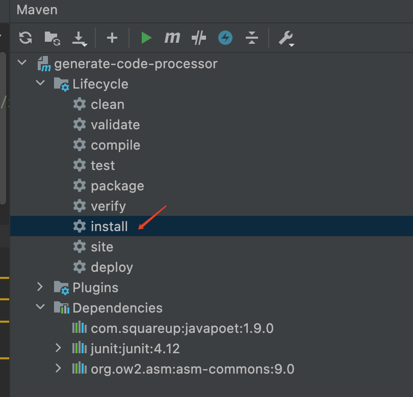
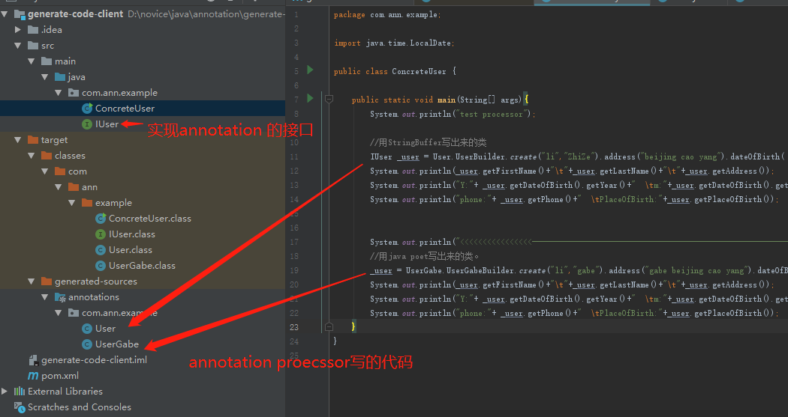
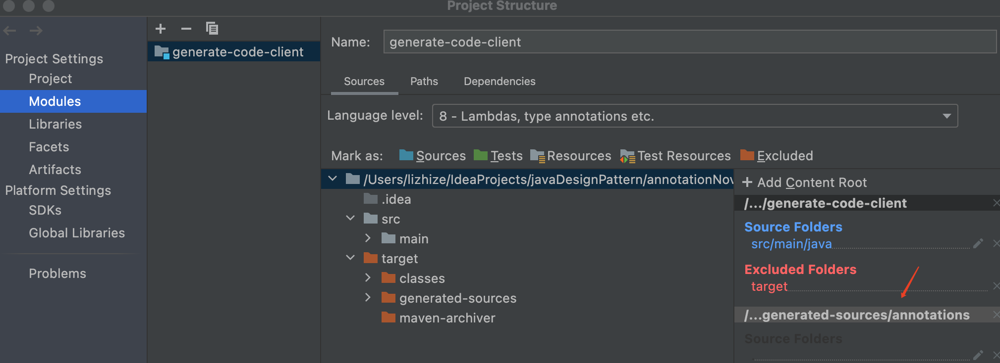

# Java 注解（Annotation）不要重复自己
Java 注解（Annotation）又称 Java 标注，是 JDK5.0 引入的一种注释机制。

## annotation 用途
注解本身不带作何功能，本质上它只是一种标记。
凡标记必有意义，使用者赋予它什么样的意义，它就可以用来做什么。
Annotation 是一个辅助类，它在 Junit、Struts、Spring 、android room等工具框架中被广泛使用。

我们在编程中经常会使用到的 Annotation 作用有：

### 1）编译检查
提前发现一些语法错误，发现BUG。

### 2）生成代码,多用于配置工程。

### 3）生成帮助文档
通过给 Annotation 注解加上 @Documented 标签，能使该 Annotation 标签出现在 javadoc 中。

### 4）能够帮忙查看查看代码
通过 @Override, @Deprecated 等，我们能很方便的了解程序的大致结构。

后面我会介绍一些工具（maven plug ,google autoService）。这些工具简化了注解的使用，辅助注解高效完成其任务。

## annotation 的限制
它原本的设计只能用于产生新的java代码文件，不能修改原有java代码文件。
有黑科技可以改java文件。如 Lombok 库，它可以自动生成get set函数，在这里不讨论其实现方式。

## 相同功能的工具
 XML 是另一种配置项目的工具。它比 annotation早很多，各有优缺点。

| 权衡点  | xml   |  annotatition |
|:------ | :------ |:----|
| 耦合度 | 低 | 高 |
| 复杂度 | 低 | 高 |
| 维护性 | 难 | 易 |

## annotation 起作用的时机
annotation本身只是个标记，表明自己的属性，不产生作何动作。
真正让 annotation 起作用的是Annotation Processing Tool (apt)。这是一个JDK的工具。
参考：
    <https://docs.oracle.com/javase/7/docs/technotes/guides/apt/index.html>

编译器如何找到 annotation processor ？
一种标准的做法（oracle 建议的方法)
创建META-INF/service/javax.annotation.processing.Processor文件。文件的格式为：每行是一个annotation processor 的包名+类名。

如果你用命令行，那么你需要声明annotation processor 的路径。javac 带上参数 -processorpath。
javac -processorpath processor.jar -proc:only -processor x.y.z.MyAnnotationProcessor -verbose -sourcepath src\main\java -cp src\main\java src\main\java\x\y\z\*.java 
参考：
  <http://www.javatronic.fr/articles/2014/08/31/how_to_make_sure_javac_is_using_a_specific_annotation_processor.html#customize-the-command-line>
  <http://www.javatronic.fr/articles/2014/10/08/how_does_annotation_processing_work_in_java.html>

## 注意事项

### round机制
因为一轮round可能生成annotation的子集,所以可能需要再round一次。 
在每一轮中，可能会要求annotation Processor处理在上一轮产生的源文件和类文件中找到的annotation的子集。
1，如果将使用的annotation Processor没有实例化，则该工具将调用该annotation Processor的no-arg构造函数以创建处理器的实例。

2，接下来，该工具使用适当的ProcessingEnvironment调用init方法。

3，之后，该工具将调用getSupportedAnnotationTypes，getSupportedOptions和getSupportedSourceVersion。 这些方法每次运行仅调用一次，而不是在每个round中调用一次。

4，该工具将在适当的时候调用Processor对象上的处理方法。 不会为每个round创建一个新的Pannotation Processor对象。

5，确保它们被完全执行了。如果没有则启动下一轮round。

### annotation processor执行顺序
编译工具决定不同annotation processor的执行顺序。
如： 对于JavaCompiler，可以直接设置要运行的候选处理器的列表。

### 健壮的annotation processor
为了鲁棒性,annotation processor 遵守以下规则：
正交性：annotation processor处理某个输入的结果与（是否存在）其他输入无关。  直观的说就是每次round的结果是独立的。
一致性：处理相同的输入会产生相同的输出。
无序性：处理输入A然后处理输入B等于处理B然后处理A 。
独立性：处理输入不依赖于其他annotation processor 的输出 。

## 码农关注的用途，通过生成代码配置工程
日复一日，简单的工作重复做。也可以让机器来帮你写代码，所以不要重复自己了。

## 与annotation 有关的工具
用于编译，代码仓库：
maven plug。

这个比较好用，我们需要先编译annotation processor.
使用annotation processor的project 依赖  annotation processor project.
编译顺序的问题就好解决了。

annotation自动编译：
autoService

android项目里常用这个配置annotation processor

生成代码：
javaPoet 相对较新，在annotation processor使用，简单好用。

asm 老工具，功能多。不仅可用写java 代码,还可以改.class文件。

bcel 老工具，功能多。不仅可用写java 代码,还可以改.class文件。

##  annotation常见用例

这是个例子。用到了maven plug。请先编 annotation processor。我把annotation  也放到了annotation processor项目里，所以跟常见的例子相比，它少了一个project。

调用 gererate-code-processor工程里的maven. 将annotation processor 发布到本地maven,以便让generate-code-client项目引用

https://github.com/lizzneil/annotationNovice.git

如果generate-code-client有编译时有问题，请把注解生成的代码加到source目录下。

**未完待续**